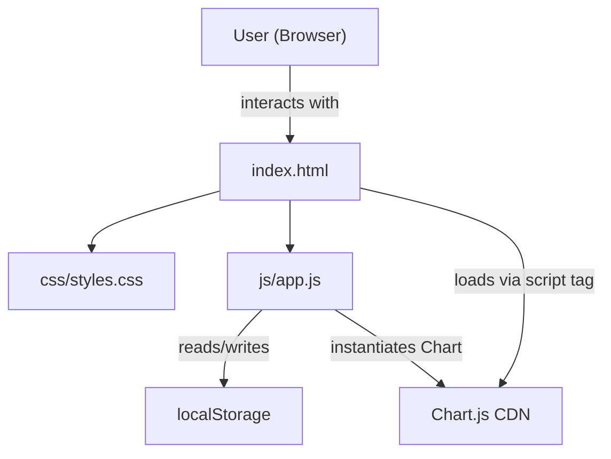
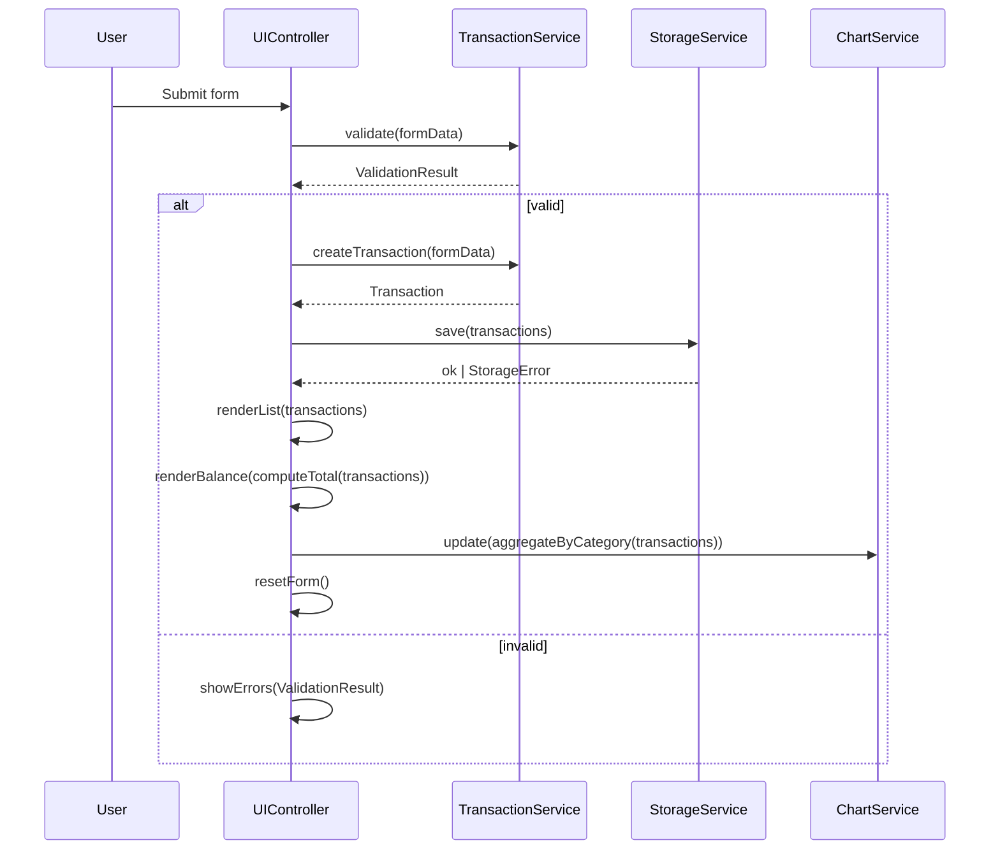
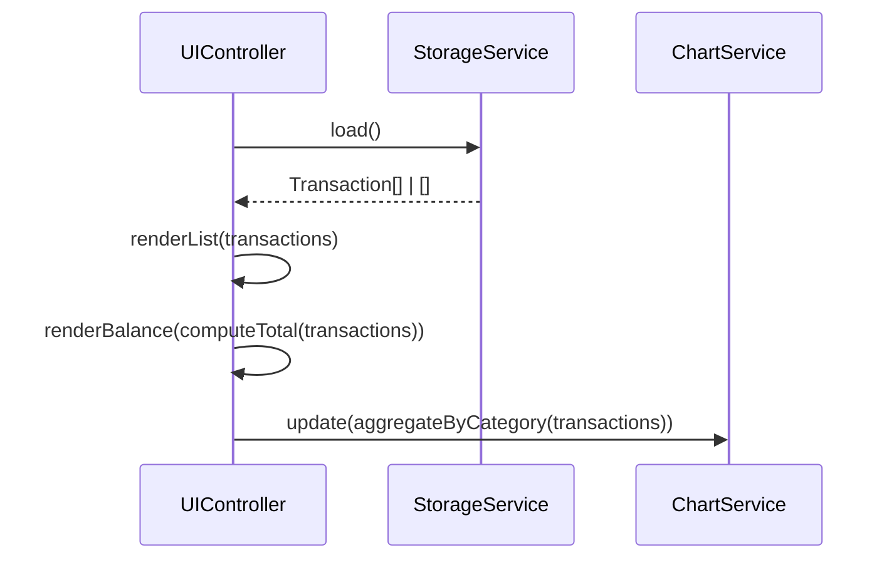

# Design Document: Expense Visualizer

## Overview

The Expense Visualizer is a purely client-side single-page web application for tracking personal expenses. It runs entirely in the browser with no build step, no framework, and no backend — just a single HTML file, one CSS file, and one JavaScript file. Data persists across sessions via the browser's `localStorage` API. A pie chart powered by Chart.js v4 (loaded from a CDN) gives users a live view of their spending distribution by category.

The three supported categories are: **Food**, **Transport**, and **Fun**.

### Design Goals

- Keep the codebase flat and dependency-free at the server level.
- Isolate pure logic (validation, aggregation, formatting) from side-effectful code (DOM manipulation, localStorage, Chart.js) to enable reliable unit and property testing.
- Ensure all UI state derives from a single in-memory `transactions` array that is always kept in sync with `localStorage`.

---

## Architecture

The application follows a layered, module-style architecture within a single JavaScript file. Four logical "services" or "controllers" handle distinct concerns:



### Module Breakdown

```
js/app.js
├── StorageService        — thin wrapper around localStorage (read/write/error-handling)
├── TransactionService    — pure functions: validate, computeTotal, aggregateByCategory, formatAmount
├── ChartService          — owns the Chart.js instance; exposes update(data) method
└── UIController          — DOM manipulation, event wiring, renders list/balance/errors, orchestrates the other three
```

**Data flow on user action:**



**Data flow on page load:**



---

## Components and Interfaces

### File Structure

```
expense-visualizer/
├── index.html
├── css/
│   └── styles.css
└── js/
    └── app.js
```

### index.html

Provides the page structure. Key elements:

| Element | ID / Class | Role |
|---|---|---|
| Form | `#expense-form` | Input_Form |
| Text input | `#item-name` | Item name field |
| Number input | `#item-amount` | Amount field |
| Select | `#item-category` | Category dropdown |
| Submit button | `#submit-btn` | Triggers add |
| Error containers | `.field-error[data-for]` | Inline validation messages |
| Ordered list | `#transaction-list` | Transaction_List |
| Span | `#balance-amount` | Balance_Display value |
| Canvas | `#spending-chart` | Chart rendering target |
| Script tag | — | Chart.js v4 from jsDelivr CDN |

Chart.js CDN script tag:
```html
<script src="https://cdn.jsdelivr.net/npm/chart.js@4/dist/chart.umd.min.js"></script>
```

### TransactionService (Pure Functions)

All functions are stateless — no DOM or storage side effects.

```javascript
/**
 * @typedef {{ id: string, name: string, amount: number, category: string, createdAt: number }} Transaction
 */

/** Generates a unique ID for a new transaction. Returns string. */
function generateId()

/**
 * Validates raw form data. Returns { valid: boolean, errors: { name?, amount?, category? } }.
 * Rules:
 *   name: 1–100 characters (after trimming)
 *   amount: numeric, 0.01 ≤ value ≤ 999999999.99
 *   category: one of ['Food', 'Transport', 'Fun']
 */
function validateForm(formData)

/**
 * Creates a Transaction object from valid form data. Does not validate.
 */
function createTransaction(formData)

/**
 * Returns the sum of all transaction amounts, rounded to 2 decimal places.
 * Returns 0 for an empty array.
 */
function computeTotal(transactions)

/**
 * Returns an object mapping each category to its summed amount.
 * Example: { Food: 42.50, Transport: 15.00, Fun: 0 }
 * Always includes all three categories; missing ones default to 0.
 */
function aggregateByCategory(transactions)

/**
 * Formats a numeric amount to a string with exactly 2 decimal places.
 * Example: 5 → "5.00", 12.1 → "12.10"
 */
function formatAmount(amount)

/**
 * Sorts transactions by createdAt descending (newest first).
 * Returns a new array (does not mutate).
 */
function sortByNewest(transactions)

/**
 * Truncates a string to maxLen characters. Returns the string unchanged if within limit.
 */
function truncate(str, maxLen)
```

### StorageService

Thin wrapper that isolates all `localStorage` interactions.

```javascript
const STORAGE_KEY = 'expense-visualizer-transactions';

/**
 * Reads and parses transactions from localStorage.
 * Returns [] if key is absent, localStorage is unavailable, or JSON is invalid.
 * Never throws.
 */
function loadTransactions()

/**
 * Serializes and writes the transactions array to localStorage.
 * Throws StorageError if localStorage is unavailable or quota exceeded.
 */
function saveTransactions(transactions)
```

### ChartService

Owns a single `Chart` instance, avoiding duplicate chart creation on re-renders.

```javascript
/**
 * Initializes the Chart.js pie chart on the canvas element.
 * Must be called once after the DOM is ready.
 */
function initChart(canvasId)

/**
 * Updates the chart with new category data.
 * @param {{ Food: number, Transport: number, Fun: number }} categoryTotals
 * Shows a placeholder/empty state when all values are 0.
 */
function updateChart(categoryTotals)
```

### UIController

Wires DOM events and orchestrates the other services. Not independently unit-testable at the function level — tested via integration tests.

Key responsibilities:
- Attach `submit` listener on `#expense-form`
- Delegate to `TransactionService.validateForm` before any mutation
- Show/clear inline errors via `.field-error[data-for="field-name"]` elements
- Render the transaction list as `<li>` elements with delete buttons (`data-id`)
- Attach delegated `click` listener on `#transaction-list` for delete actions
- Call `resetForm()` after a successful add

---

## Data Models

### Transaction

```javascript
/**
 * @typedef {Object} Transaction
 * @property {string}  id         — UUID-style unique identifier (crypto.randomUUID or fallback)
 * @property {string}  name       — Item name, 1–100 characters (stored trimmed)
 * @property {number}  amount     — Positive float, 0.01–999999999.99
 * @property {string}  category   — One of: 'Food' | 'Transport' | 'Fun'
 * @property {number}  createdAt  — Unix timestamp in milliseconds (Date.now())
 */
```

### ValidationResult

```javascript
/**
 * @typedef {Object} ValidationResult
 * @property {boolean} valid
 * @property {Object}  errors
 * @property {string}  [errors.name]     — Error message for name field, if any
 * @property {string}  [errors.amount]   — Error message for amount field, if any
 * @property {string}  [errors.category] — Error message for category field, if any
 */
```

### localStorage Schema

Stored under a single key `'expense-visualizer-transactions'` as a JSON array of `Transaction` objects:

```json
[
  {
    "id": "a1b2c3d4-...",
    "name": "Coffee",
    "amount": 4.50,
    "category": "Food",
    "createdAt": 1700000000000
  }
]
```

**Invariants:**
- The array is always replaced in full on every write (no partial updates).
- The key is the same for reads and writes across the entire application lifecycle.
- On a read error or parse failure, the app silently initializes with `[]`.

### CategoryTotals (in-memory aggregate)

```javascript
/**
 * @typedef {Object} CategoryTotals
 * @property {number} Food
 * @property {number} Transport
 * @property {number} Fun
 */
```

Always has all three keys. Missing categories default to `0`.

---

## Correctness Properties

*A property is a characteristic or behavior that should hold true across all valid executions of a system — essentially, a formal statement about what the system should do. Properties serve as the bridge between human-readable specifications and machine-verifiable correctness guarantees.*

### Property 1: Valid transaction addition is reflected in state and storage

*For any* valid transaction input (name with 1–100 non-whitespace characters, amount between 0.01 and 999999999.99, valid category), after the add operation completes, the transactions array should contain the new transaction AND `localStorage` should contain the serialized JSON of the complete updated array.

**Validates: Requirements 1.2, 5.1**

---

### Property 2: Empty or whitespace fields are always rejected

*For any* form submission where at least one required field (name, amount, or category) is empty or consists entirely of whitespace, the validator should reject it, the transactions array should remain unchanged, and a validation error should be associated with each empty field.

**Validates: Requirements 1.3**

---

### Property 3: Out-of-range inputs are always rejected

*For any* amount value less than 0.01 or greater than 999999999.99, or any item name longer than 100 characters, the validator should reject the submission, the transactions array should remain unchanged, and a validation error should be associated with the offending field.

**Validates: Requirements 1.4**

---

### Property 4: Form resets after every successful addition

*For any* valid transaction, after a successful add operation the form's name field value, amount field value, and category field selection should all be in their empty/default cleared state.

**Validates: Requirements 1.5**

---

### Property 5: Transaction list is always sorted newest-first with correct formatting

*For any* non-empty array of transactions, `sortByNewest` should return a new array where each adjacent pair satisfies `transactions[i].createdAt >= transactions[i+1].createdAt`, item names exceeding 100 characters should be truncated, and `formatAmount` should produce a string with exactly 2 decimal places for every entry.

**Validates: Requirements 2.1**

---

### Property 6: Deletion removes a transaction from state and storage

*For any* non-empty transactions array, deleting any transaction by its `id` should result in an array that does not contain a transaction with that `id`, and `localStorage` should reflect the updated array under the consistent key.

**Validates: Requirements 2.3, 5.2**

---

### Property 7: localStorage round-trip restores the full transaction list

*For any* array of transactions written to `localStorage` via `saveTransactions`, calling `loadTransactions` should return an array equal in length and content (same `id`, `name`, `amount`, `category`, `createdAt` for each entry) to the original array.

**Validates: Requirements 2.4, 5.3**

---

### Property 8: Total balance is always the rounded sum of all amounts

*For any* array of transactions (including the empty array), `computeTotal` should return a value equal to the mathematical sum of all `amount` fields rounded to 2 decimal places. For the empty array, the result should be `0.00`.

**Validates: Requirements 3.1, 3.4**

---

### Property 9: Category aggregation sums to the overall total

*For any* array of transactions, the sum of all values in the object returned by `aggregateByCategory` should equal `computeTotal` applied to the same array. Every category key (`Food`, `Transport`, `Fun`) should always be present, and missing categories should have a value of `0`.

**Validates: Requirements 4.1, 4.4**

---

## Error Handling

### localStorage Unavailability

Two distinct failure modes must be handled:

| Scenario | Trigger | Behavior |
|---|---|---|
| Write failure (add/delete) | `localStorage.setItem` throws (storage full, private browsing, blocked) | Abort the mutation, keep in-memory state unchanged, display a non-inline error message (e.g., "Your expense could not be saved. Please check your browser settings.") |
| Read failure on init | `localStorage.getItem` throws or JSON.parse fails | Initialize with empty `[]` silently — no error shown to user |

`StorageService` wraps all `localStorage` calls in `try/catch`. `saveTransactions` re-throws a typed `StorageError`. `loadTransactions` returns `[]` on any error.

### Form Validation Errors

Inline errors are displayed adjacent to each invalid field using `.field-error[data-for="field-name"]` elements. Errors are cleared before each new validation run. Successful submission also clears all errors.

### Chart.js CDN Load Failure

If the Chart.js CDN script fails to load (offline, CDN outage), the canvas will not render. The app will still be functional for adding/deleting transactions and displaying the balance and list. The `ChartService.initChart` call is guarded: if `window.Chart` is undefined, the chart section is hidden and a static message ("Chart unavailable — could not load charting library.") is shown in its place.

### Invalid Data in localStorage

If the stored JSON parses successfully but contains entries with unexpected shapes (missing fields, wrong types), `loadTransactions` applies a filter that discards malformed entries before returning. Valid entries are preserved.

---

## Testing Strategy

### Dual Testing Approach

The codebase separates pure logic (`TransactionService`, `StorageService`) from DOM manipulation (`UIController`, `ChartService`). This separation enables:

- **Property-based tests** for all pure functions — these run 100+ generated inputs each.
- **Unit tests** for specific examples, edge cases, and integration points.
- **Manual/smoke tests** for layout, responsiveness, and CDN loading.

### Property-Based Testing

**Library**: [fast-check](https://github.com/dubzzz/fast-check) — the standard PBT library for JavaScript.

Each property test runs a minimum of 100 iterations via fast-check's `fc.assert(fc.property(...))`. Each test is tagged with a comment referencing its design property.

Example tag format:
```javascript
// Feature: expense-visualizer, Property 8: computeTotal is always the rounded sum of all amounts
```

**Properties to implement as property-based tests:**

| Property | Function(s) under test | Generator strategy |
|---|---|---|
| P1: Valid addition round-trip | `createTransaction`, `saveTransactions`, `loadTransactions` | `fc.record({ name: fc.string({minLength:1,maxLength:100}), amount: fc.float({min:0.01,max:999999999.99}), category: fc.constantFrom('Food','Transport','Fun') })` |
| P2: Empty/whitespace fields rejected | `validateForm` | `fc.record` with one or more fields as `fc.constant('')` or `fc.stringMatching(/^\s+$/)` |
| P3: Out-of-range inputs rejected | `validateForm` | `fc.oneof(fc.float({max:0}), fc.float({min:1000000000}))` for amount; `fc.string({minLength:101})` for name |
| P4: Form resets after add | `UIController` integration | `fc.record` with valid inputs; assert DOM state after submit |
| P5: Sort newest-first & formatting | `sortByNewest`, `formatAmount`, `truncate` | `fc.array(fc.record({...}), {minLength:1})` |
| P6: Delete removes from state & storage | `saveTransactions`, `loadTransactions` | `fc.array(transactions, {minLength:1})` + `fc.nat` to pick index |
| P7: localStorage round-trip | `saveTransactions`, `loadTransactions` | `fc.array` of valid Transaction objects |
| P8: computeTotal is rounded sum | `computeTotal` | `fc.array(fc.record({amount: fc.float({min:0.01})}))` including empty array |
| P9: aggregateByCategory sums to total | `aggregateByCategory`, `computeTotal` | `fc.array` of transactions with random categories |

### Unit Tests (Example-Based)

Specific scenarios not covered by property generators:

- Form renders with exactly three category options: Food, Transport, Fun (Req 1.1)
- Empty transaction list shows placeholder message (Req 2.5)
- `loadTransactions` returns `[]` when `localStorage` throws on read (Req 5.4)
- `loadTransactions` returns `[]` when stored value is invalid JSON (Req 5.4)
- App handles `localStorage.setItem` throwing on form submit — shows error, no state change (Req 1.6)
- Malformed localStorage entries are discarded on load, valid entries preserved

### Smoke / Manual Tests

- index.html contains `<script src="https://cdn.jsdelivr.net/npm/chart.js@4/...">` (Req 4.5)
- File structure: exactly one CSS file in `css/`, one JS file in `js/` (Req 6.3, 6.4)
- App opens as a local `file://` URL in Chrome, Firefox, Edge, Safari (Req 6.2)
- Layout is readable at 320px, 768px, 1280px, and 1920px viewport widths (Req 7.3)
- Initial page load time ≤ 3 seconds on broadband (Req 7.2)
- Transaction list is scrollable when it overflows its container (Req 2.2)

### Integration Tests

- Adding a transaction updates Transaction_List, Balance_Display, and Chart within 500ms (Req 7.1)
- Deleting a transaction updates all three UI regions within 500ms (Req 7.1)
